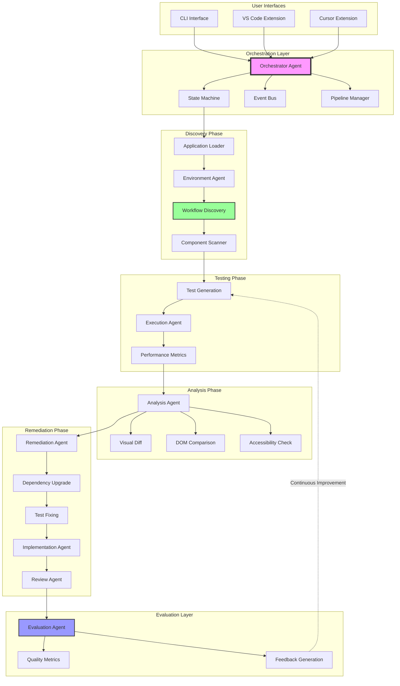
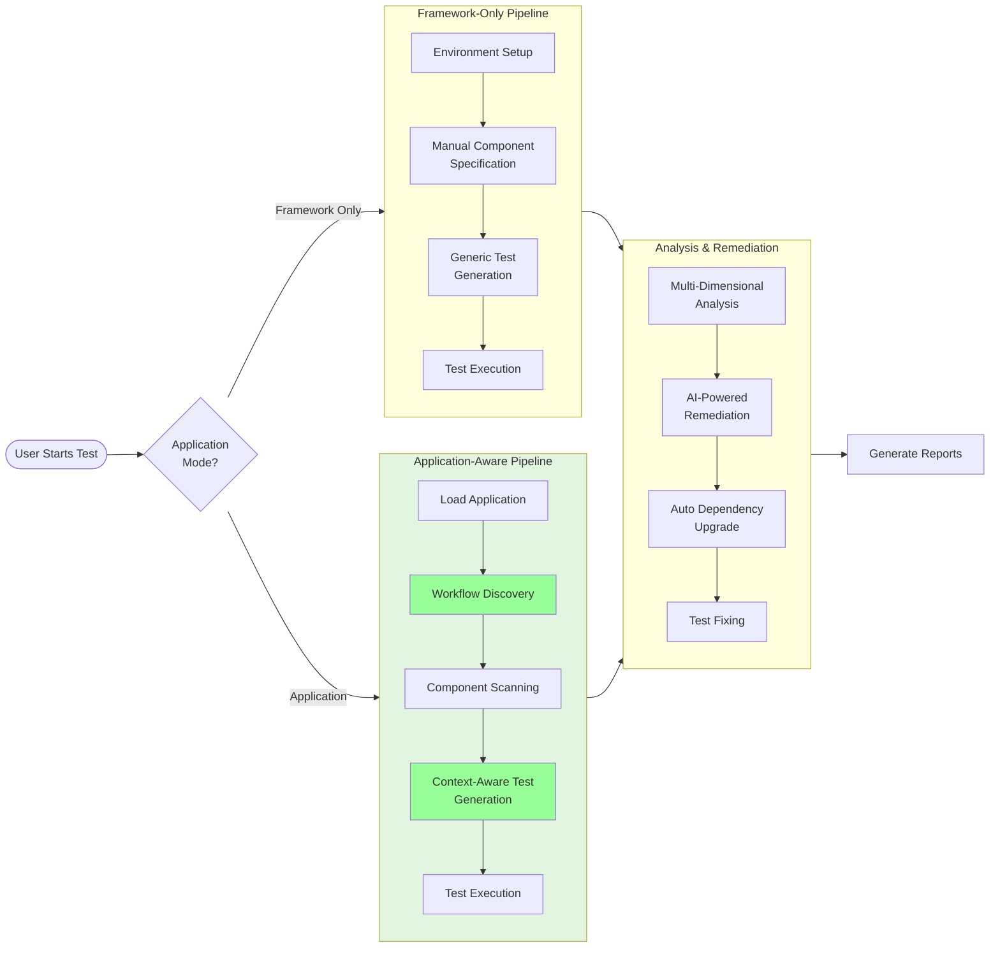
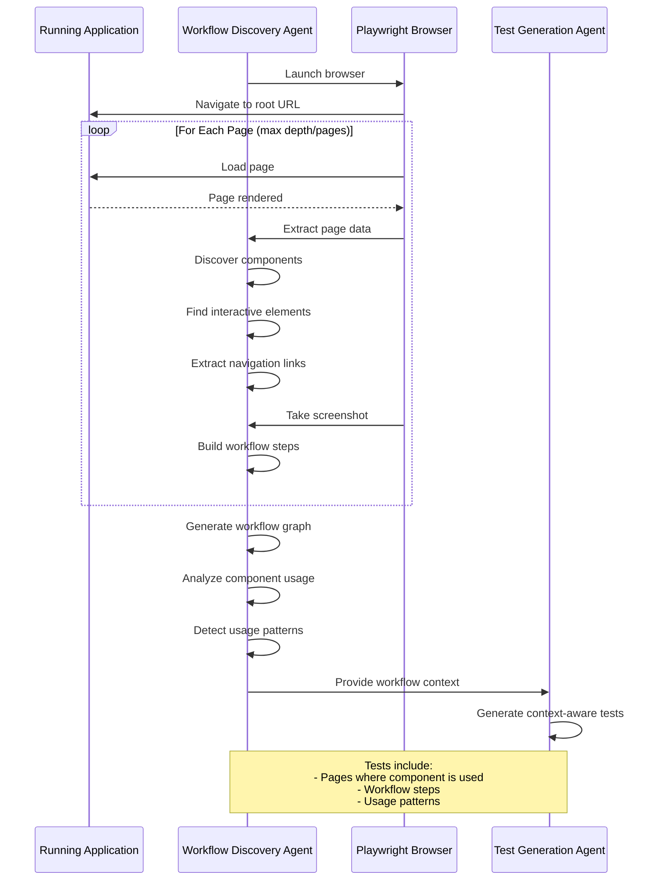
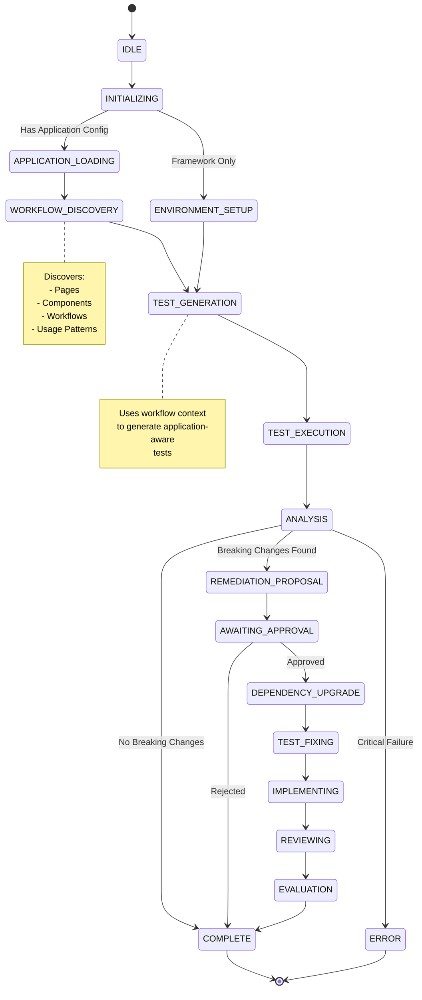
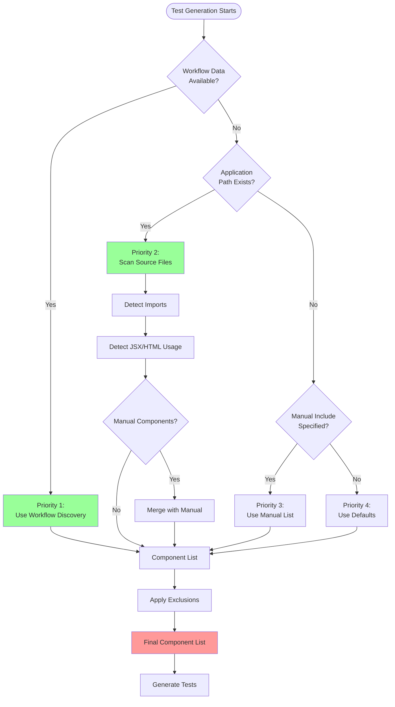
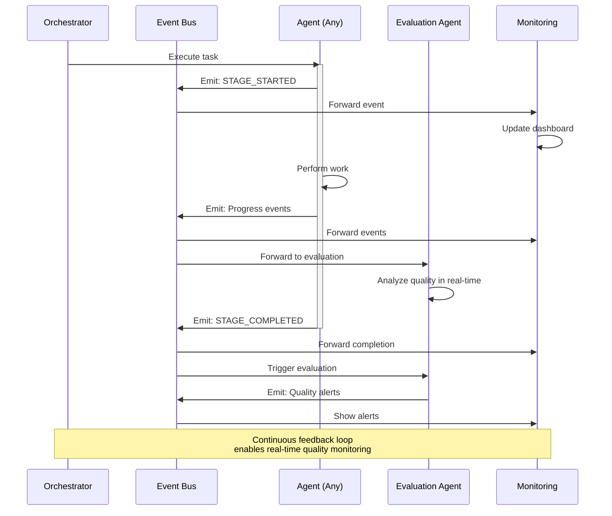
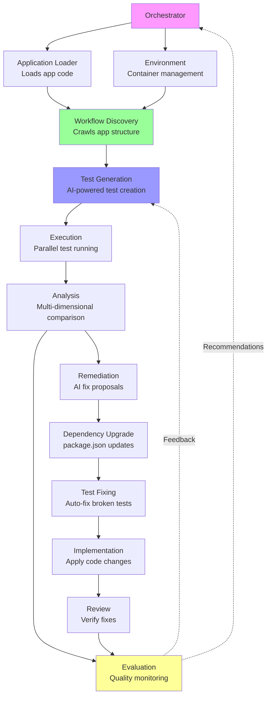
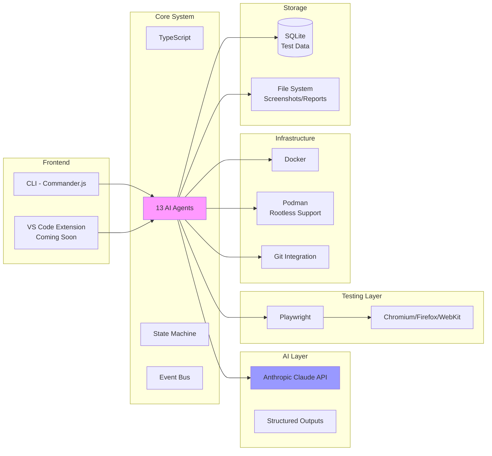

# PixelDust Architecture Diagrams

This document contains visual representations of the PixelDust architecture using Mermaid diagrams. These diagrams can be rendered in GitHub, GitLab, and many documentation tools.

## System Overview



## Application-Aware Testing Pipeline



## Workflow Discovery Process



## Agent State Machine



## Component Discovery Flow



## Data Flow Architecture

```mermaid
flowchart LR
    subgraph Input
        Config[Configuration File]
        App[Application Code]
    end

    subgraph Discovery
        WF[Workflow Discovery]
        CS[Component Scanner]
    end

    subgraph Context[Test Context]
        Pages[Pages Data]
        Workflows[Workflows Data]
        Components[Component List]
        Usage[Usage Patterns]
    end

    subgraph Generation
        Prompt[AI Prompt Builder]
        AI[Claude API]
        Tests[Generated Tests]
    end

    subgraph Execution
        Containers[Docker/Podman<br/>Containers]
        Playwright[Playwright<br/>Test Runner]
        Results[Test Results]
    end

    subgraph Storage
        DB[(SQLite Database)]
        FS[File System<br/>(Screenshots, Reports)]
    end

    Config --> WF
    App --> WF
    App --> CS

    WF --> Pages
    WF --> Workflows
    WF --> Components
    WF --> Usage

    CS --> Components

    Pages --> Prompt
    Workflows --> Prompt
    Components --> Prompt
    Usage --> Prompt

    Prompt --> AI
    AI --> Tests

    Tests --> Playwright
    Containers --> Playwright
    Playwright --> Results

    Results --> DB
    Results --> FS
    Pages --> DB
    Workflows --> DB

    style WF fill:#9f9
    style CS fill:#9f9
    style Prompt fill:#99f
    style DB fill:#f99
```

## Event-Driven Architecture



## 13 Agents Collaboration



## Technology Stack



---

## How to Use These Diagrams

### In GitHub/GitLab
These Mermaid diagrams will render automatically in Markdown files.

### In Documentation Tools
Most modern documentation tools support Mermaid:
- Docusaurus
- VuePress
- GitBook
- Notion
- Confluence (with plugins)

### Export as Images
Use tools like:
- [Mermaid Live Editor](https://mermaid.live/)
- `mmdc` CLI tool
- VS Code Mermaid extensions

### Example Export Command
```bash
npm install -g @mermaid-js/mermaid-cli
mmdc -i ARCHITECTURE_DIAGRAM.md -o architecture.png
```

---

## Diagram Legend

| Color | Meaning |
|-------|---------|
| 🟣 Purple | Orchestration/Control |
| 🟢 Green | Discovery/Intelligence |
| 🔵 Blue | AI/Generation |
| 🟡 Yellow | Evaluation/Feedback |
| 🔴 Red | Critical/Storage |
